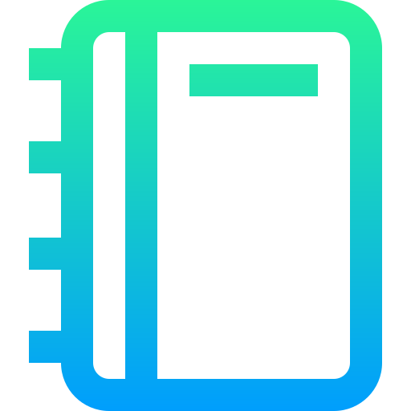

<h1 align="center">Hey everyone! Welcome aboard!👋</h1>
<h2>About me</h2>
<ul>
  <li> 🚀 Currently working on Compliance, Marketing, Business & Software Development.</li>
  <li> 🌱 Learning Web Development, Typescript, NodeJS and so on!</li>
  <li> 💛 Pronouns: he / him</li>
  <li> ⚡ Fun fact: I'm a lawyer trying to dive deeply into the codeverse!</li>
</ul>
 

  
  

 
  
  
  
  
  
  
  
  
  
  
  
  
<!--    -->
  
  

<h2>Get in touch</h2>

  &emsp;&emsp;
  &emsp;&emsp;
  &emsp;&emsp;
  &emsp;&emsp;
  

<!--

  
  
  
  
  

-->
